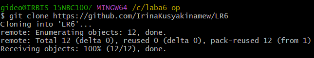

# Лабораторная работа №6

## 1. Цель работы

Целью данной лабораторной работы является изучение базовых возможностей системы управления версиями, опыт работы с Git Api, опыт работы с локальным и удаленным репозиторием.

## 2. Основная часть лабораторной работы

### 2.1. Форк репозитория

Первоначальным шагом в выполнении лабораторной работы является создание копии репозитория в личное хранилище. Для этого создадим новый форк, скопировав обе ветки репозитория: master и branch1.


### 2.2. Настройки для клиента git

После копирования репозитория в личное хранилище необходимо задать имя и почту для пользователя. Сделаем это в Git Bush при помощи специальных команд.


### 2.3. Клонирование личного удаленного репозитория

Создадим папку, в которую будет клонирован личный удаленный репозиторий со всеми его файлами.



### 2.4. Добавление файла через интерфейс GitHub

Чтобы добавить файл через GitHub, необходимо перейти в свой удаленный репозиторий и нажать ```add file```, после чего выбрать ```create new file```. Давайте добавим текстовый файл в основную ветку master.


### 2.5. Подтягивание изменений в локальный репозиторий

Подтягиваем изменение, добавление нового файла, в локальный репозиторий.


### 2.6. История операций для веток

Следующим шагом является получение истории операции для двух веток - master и branch1. Осуществим это при помощи специальных команд git.


### 2.7. Последние изменения в ветках

Далее необходимо просмотреть последние изменения в каждой из двух веток. Поочереди переключимся с одной ветки на другую и применим к ним команду просмотра последнего коммита.


### 2.8. Слияние в ветку master

Для того, чтобы выполнить слияние побочной ветки branch1 в ветку master требуется предварительно разрешить конфликт в виде не добавленного в индекс измененного файла mergefile.txt. Сначала подтянем изменения в основную ветку master, после этого применим команду слияния, добавив измененный файл в индекс. Сделаем коммит и запушим изменения в ветку master.


