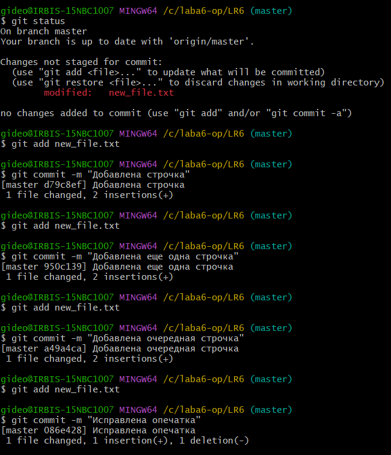

# Лабораторная работа №6

## 1. Цель работы

Целью данной лабораторной работы является изучение базовых возможностей системы управления версиями, опыт работы с Git Api, опыт работы с локальным и удаленным репозиторием.

## 2. Основная часть лабораторной работы

### 2.1. Форк репозитория

Первоначальным шагом в выполнении лабораторной работы является создание копии репозитория в личное хранилище. Для этого создадим новый форк, скопировав обе ветки репозитория: master и branch1.


### 2.2. Настройки для клиента git

После копирования репозитория в личное хранилище необходимо задать имя и почту для пользователя. Сделаем это в Git Bush при помощи специальных команд.


### 2.3. Клонирование личного удаленного репозитория

Создадим папку, в которую будет клонирован личный удаленный репозиторий со всеми его файлами.


### 2.4. Добавление файла через интерфейс GitHub

Чтобы добавить файл через GitHub, необходимо перейти в свой удаленный репозиторий и нажать ```add file```, после чего выбрать ```create new file```. Давайте добавим текстовый файл в основную ветку master.


### 2.5. Подтягивание изменений в локальный репозиторий

Подтягиваем изменение, добавление нового файла, в локальный репозиторий.


### 2.6. История операций для веток

Следующим шагом является получение истории операции для двух веток - master и branch1. Осуществим это при помощи специальных команд git.


### 2.7. Последние изменения в ветках

Далее необходимо просмотреть последние изменения в каждой из двух веток. Поочереди переключимся с одной ветки на другую и применим к ним команду просмотра последнего коммита.


### 2.8. Слияние в ветку master

Для того, чтобы выполнить слияние побочной ветки branch1 в ветку master требуется предварительно разрешить конфликт в виде не добавленного в индекс измененного файла mergefile.txt. Сначала подтянем изменения в основную ветку master, после этого применим команду слияния, добавив измененный файл в индекс. Сделаем коммит и запушим изменения в ветку master.


### 2.9. Удаление побочной ветки

После слияния branch1 в master нужно удалить побочную ветку при помощи команды, указанной на скриншоте снизу.


### 2.10. Создание коммитов

Требуется сделать изменения в файлах и зафиксировать их, оставляя комментарии. Проделаем эти операции над ранее созданным файлом new_file.txt.



### 2.11. Откат коммита

Осуществим откат коммита, указав хеш того коммита, на который мы хотим переключиться. Все изменения, которые были сделаны после коммита с указанным хешем, будут отменены.


### 2.12. Создание ветки для отчета

Создадим ветку, внутри которой будет написан отчет. Не забудем отправить созданную ветку на удаленный репозиторий.


## 3. Лог команд

В процессе выполнения лабораторной работы были использованы следующие команды:

```
git config --global user.name "4318 Кусякина И.В."
git config --global user.email irina-kusyakina@yandex.ru
git config user.name
git config user.email
git clone https://github.com/IrinaKusyakinamew/LR6
git pull origin master
git checkout master
git checkout branch1
git log --oneline
git show
git merge branch1
git status
git add .
git commit -m "описание коммита"
git push origin master
git push origin --delete branch1
git reset --hard d8d90
git checkout -b new_branch
git push origin new_branch
```
## 4. История операций в форматированном виде


## 5. Вывод
В результате выполнения данной лабораторной работы я изучила базовые возможности системы управления версиями, получила опыт работы с Git Api, а также с локальным и удаленным репозиторием.


